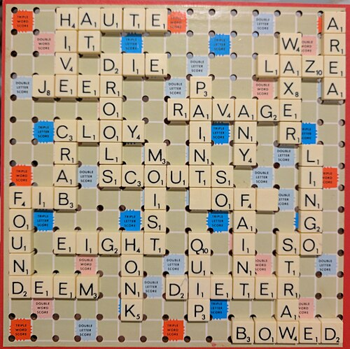
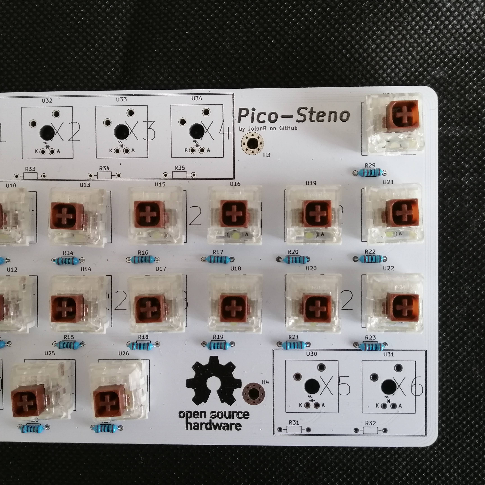
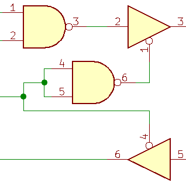
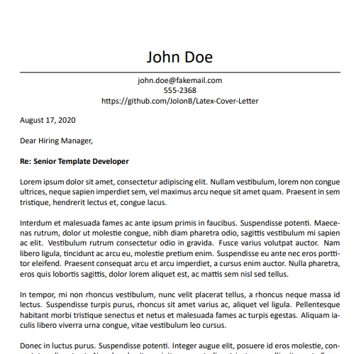

# Jolon Behrent

## Projects

<!-- 

<h3><a class="undline" href="https://github.com/JolonB/">Card Example</a></h3>

Fill this in. <i class="fas fa-fw fa-hammer"></i>

 -->

<h3><a class="undline" href="https://github.com/JolonB?tab=repositories&q=word+game">Electronic Scrabble</a></h3>

Don't you wish your Scrabble board could keep score for you, and show cool backlight animations when you spell words?
This project uses nine 5x5 boards to create a 15x15 square Scrabble board with individually controllable LEDs in each square.
Each tile can be sensed to uniquely determine the letter present on it, and points for valid words are automatically calculated (including bonus score squares).

The game is still in the prototype stage, but is slowly being worked on.
I've currently had a few PCBs printed and I'm working on the software for them.

<!--  -->

<h3><a class="undline" href="assets/pdf/final_report.pdf">IoT Environmental Monitoring - Honours Project</a></h3>

<!--  -->

My honours project involved working with <a href="https://benjamin.secker.nz/">Benjamin Secker</a> to develop an Internet of Things environmental monitoring solution for the Greater Wellington Regional Council. I was tasked with developing the hardware and the low-level software.

The project was large in scope but came close to being finished by the end of the 8-month time frame. The device was capable of reliably reading data from SDI-12 sensors then saving it to an SD card and sending it to a cloud backend. There's too much to write about in this little box, so if you want to read more about it, you can find the final report <a href="assets/pdf/final_report.pdf">here</a>.

This project was continued part-time after I had graduated.
This involved making various upgrades to the electronics, including adding a USB-C port, interfacing for a new modem, and updating the rainfall monitoring system.

<!--  -->

<h3><a class="undline" href="https://github.com/JolonB/Pico-Steno">Raspberry Pi Pico-based Stenography Keyboard</a></h3>

Sometimes I see something that I think is cool and really want to try it out.
Most recently, this was stenography.
Unfortunately, proper stenography gear is expensive, and even the open-source ones cost upwards of $100.
I wanted to develop my own stenography keyboard using a Rasbperry Pi Pico.
The keyboard software and hardware was all developed and designed by me.
It has been made to be compatible with <a href="https://github.com/openstenoproject/plover">Plover</a>.
This is the first project that I have printed a PCB for, but it won't be the last.

<!--  -->

<h3><a class="undline" href="https://github.com/JolonB/XmasTree">3D Christmas Tree Light Animations</a></h3>

Inspired by <a href="https://www.youtube.com/watch?v=TvlpIojusBE">Matt Parker's Christmas tree project</a> and the <a href="https://github.com/GSD6338/XmasTree">subsequent work done by Harvard students</a>, I decided to make my own animated Christmas tree system, but with improvements to four main areas: 1) move from Raspberry Pi to ESP32 to dramatically reduce the cost, 2) add ability to convert an mp4 video to an animation for the tree, 3) reduce the animation file size by creating a custom, lightly-compressed format, and 4) creating a user interface for configuring the tree and controlling animations.
This project is still a work in progress, which I hope to have done in time for Christmas.

<h3><a class="undline" href="https://github.com/JolonB/PrintCameraBot">3D Printer Monitor</a></h3>

<!--  -->

Not long after getting a 3D printer, I ran a 6 hour print. It was going well to begin with, but as Murphy's law would have it: when I left house, it failed. Unfortunately, I was gone for a while, so a decent amount of filament was wasted. I vowed to never let that happen again, so I developed a simple email service that can run off a Raspberry Pi which takes a photo of the printer with a webcam when requested. I know things like this already exist (there are even baby monitors that can be accessed from anywhere), but I wanted something that could be implement without needing to use anything I didn't already own.

<!--  -->

<h3><a class="undline" href="https://github.com/JolonB/Secret-Santa">Secret Santa</a></h3>

Every Christmas, starting in 2020, my family has played secret santa rather than having buying a gift for everyone. I'm personally not a fan of how secret santa works, as it is entirely possible that you will draw your own name, which could mean that everyone needs to draw a new name. You also can't factor in special rules, such as not allowing two people to give gifts to each other. This project treats the people as nodes on a graph, finds every possible Hamiltonian cycle between them, and picks one cycle at random. It then sends an email to each player telling them who they are buying a gift for.

I updated the program in 2021 to allow someone to be removed from the game after the allocations had been made. This is done by storing base64 encoded player allocations which can be read by a script and will send an email to whomever has to give a gift to a different person.

I further updated the program in 2022 in response to slow calculation times with "large" groups of people (8 people takes about 20 minutes to calculate).
I initially tried multithreading, but didn't get good results from that.
Instead, I developed a function that finds a valid, random Hamiltonian cycle with a best-case complexity of Θ(n).
The algorithm doesn't always find a valid combination (for sparse graphs), so has to retry a few times until it does.
The new algorithm can solve graphs with 1000 people in a matter of seconds.

<!--  -->

<h3><a class="undline" href="https://github.com/JolonB/Home-Security">Home Security System</a></h3>

I've set up a security system for a family member in the past but found that it was finicky and was missing a lot of important features. The better security systems are more expensive and often involve a third-party. This open-source project is for an end-to-end IoT home security system that can send text/email notifications to approved users and allow them to view footage captured by WiFi-connected nodes throughout their house. Each node is a custom-made device built on an ESP32 with the ability to be powered by battery and from mains. This is currently a work in progress.

<!--  -->

<h3><a class="undline" href="https://github.com/JolonB/Car-Security">Vehicle Tracking System</a></h3>

After my friend had his car stolen and dumped in another city, I was inspired to develop an affordable car monitoring and tracking system.
This project is currently a work in progress, but will involve a Raspberry Pi Pico connected to the <a href="https://www.hologram.io/">Hologram</a> network.
When the system is powered on, it will send information to a private MQTT broker about the location of the car.

<!--  -->

<h3><a class="undline" href="https://github.com/JolonB/SDI12-UART">UART to SDI-12 Conversion</a></h3>

SDI-12 is a wired communication protocol used for low-powered, environmental sensors. Unfortunately, I was unable to find any open-source hardware implementation of this protocol, so I needed to create something myself. The circuit I designed allows for conversion between UART and SDI-12, which means almost any microcontroller can communicate with an SDI-12 sensor (with the proper software implementation).

<!--  -->

<h3><a class="undline" href="https://github.com/JolonB/Latex-Cover-Letter">LaTeX Cover Letter Template</a></h3>

For all my previous job applications, I had written my cover letters in Word. Since they were all styled in exactly the same way, I figured I could start making them in LaTeX instead. This template is almost an exact copy of the one I made years ago in Word, except now it comes with custom commands so text can be filled in automatically.

<!--  -->

<h3><a class="undline" href="https://github.com/JolonB/RabbitGenetics">Rabbit Genetic Simulation</a></h3>

I saw <a href="https://www.youtube.com/watch?v=r_It_X7v-1E">this video</a> a few years ago and it inspired me to create something just like it. In short, it a rabbit simulations which allows them to produce offspring that have traits of the parents. I didn't want to use the video as a reference while I was designing this, so whatever I've done (good or bad) was purely my decision. This project is built using Java and Gradle. Unfortunately, it was never finished and maybe never will be.

## Experience

### Electronics & Embedded Engineer

*DTS, Remote / MilktechNZ, Remote*  
*31 July, 2023 – 31 October, 2024 / 1 November, 2024 – present*

Tasks:

- Electronic circuit design using Kicad or Altium.
- Firmware development for PIC, ESP32, and STM32 microcontrollers.
- Upgrading existing devices to use new Bluetooth LE hardware, including improving the range using Coded PHY.
- Creating tools in C++ and Python to allow users to easily calibrate their equipment.
- Developing internal tools in Python and C#.
- Updating and sometimes reverse engineering existing electronic designs.

Languages Used:

- C
- C++
- Python
- Bash

Tools Used:

- Altium
- Kicad

### Robotic Software Developer

*Clutterbot, Lower Hutt*  
*29 March, 2021 – 28 July, 2023*

Tasks:

- Developing behaviour and navigation for a household robot using ROS.

Languages Used:

- Python
- C++
- Bash

### Summer Research Assistant

*Robinson Research Institute, Lower Hutt*  
*2 November, 2020 – 26 March, 2021*

Tasks:

- Designing electronic circuit for testing a thruster.
- Designing a high-voltage, high-current switching mechanism for an energy storage solution.
- Collecting data.

Languages Used:

- MATLAB
- LabVIEW

### Embedded Software Developer/Tester

*Aviat Networks, Lower Hutt*  
*18 November, 2019 – 21 February, 2020*

Tasks:

- Writing code for embedded radio system.
- Manual testing.
- Writing automated tests.
- Working in Agile team.

Languages Used:

- C
- C++
- Python
- Bash

### Junior Design Engineer

*Tait Communications, Christchurch*  
*19 November, 2018 – 8 February, 2019*

Tasks:

- Developing tool with user interface to calculate intermodulation distortion.

Languages Used:

- Java
- Python

## Skills

  
Python<i class="fab fa-python floatright"></i>

  
C/C++<i class="fas fa-code floatright"></i>

  
Java<i class="fab fa-java floatright"></i>

  
MATLAB<!--i class="fas fa-square-root-alt floatright"></i-->

  
Circuit Design

  
Mechatronics

  
Microcontrollers

  
Linux<i class="fab fa-linux floatright"></i>

  
Git<i class="fab fa-git-alt floatright"></i>

  
Agile<!--i class="fas fa-project-diagram floatright"></i-->

  
AI<!--i class="fas fa-brain floatright"></i-->

  
Statistics<!--i class="fas fa-calculator floatright"></i-->

## Education

### University

*Victoria University of Wellington*  
Bachelor of Engineering with First Class Honours  
Electronic and Computer Systems Engineering  
2017 - 2020  
Average grade: A+

### College

*Saint Patrick's College*  
Silverstream  
2012 - 2016

## Resume

I'm more than happy to share my CV with people. Just flick me an email at [jolon.behrent@gmail.com](mailto:jolon.behrent@gmail.com?subject=CV Request&body=Hi Jolon,%0D%0A%0D%0AI'm emailing to request a copy of your CV.%0D%0A%0D%0AThanks) and I'll try to respond as soon as I can. There's no guarantee that all of the information will be up-to-date as it may have been some time since I last updated it.
