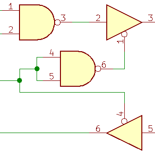

# Jolon Behrent

## Projects

Under construction <i class="fas fa-fw fa-hard-hat"></i>

<!-- 

<h3><a class="undline" href="https://github.com/JolonB/">Card Example</a></h3>

Fill this in. <i class="fas fa-fw fa-hammer"></i>

 -->

<h3><a class="undline" href="https://github.com/JolonB/SDI12-UART">UART to SDI-12 Conversion</a></h3>

Fill this in. <i class="fas fa-fw fa-hammer"></i>

<h3><a class="undline" href="https://github.com/JolonB/RabbitGenetics">Rabbit Genetic Simulation</a></h3>

Fill this in. <i class="fas fa-fw fa-hammer"></i>

<h3><a class="undline" href="https://github.com/JolonB/Latex-Cover-Letter">LaTeX Cover Letter Template</a></h3>

For all my previous job applications, I had written my cover letters in Word. Since they were all styled in exactly the same way, I figured I could start making them in LaTeX. All cover letter created from this point will use this template.

This template is almost an exact copy of the one I made years ago in Word, except now it comes with custom commands so text can be filled in automatically.

## Experience

### Embedded Software Developer/Tester

*Aviat Networks, Lower Hutt*  
*November 18, 2019 - February 21, 2020*

Tasks:

- Writing code for embedded radio system.
- Manual testing.
- Writing automated tests.
- Working in Agile team.

Languages Used:

- C/C++
- Python
- Bash

### Junior Design Engineer

*Tait Communications, Christchurch*  
*November 19, 2018 - February 8, 2019*

Tasks:

- Developing tool with user interface to calculate intermodulation distortion.

Languages Used:

- Java
- Python

## Skills

  
Python<i class="fab fa-python floatright"></i>

  
C/C++<i class="fas fa-code floatright"></i>

  
Java<i class="fab fa-java floatright"></i>

  
MATLAB<!--i class="fas fa-square-root-alt floatright"></i-->

  
Circuit Design

  
Mechatronics

  
Microcontroller

  
Linux<i class="fab fa-linux floatright"></i>

  
Git<i class="fab fa-git-alt floatright"></i>

  
Agile<!--i class="fas fa-project-diagram floatright"></i-->

  
AI<!--i class="fas fa-brain floatright"></i-->

  
Statistics<!--i class="fas fa-calculator floatright"></i-->

## Education

### University

*Victoria University of Wellington*  
Bachelor of Engineering (Hons)  
Electronic and Computer Systems Engineering  
2017 - present  
Average grade: A

### College

*Saint Patrick's College*  
Silverstream  
2012 - 2016

## Resume

You can find my resume [here](files/jolonbehrent.pdf). I'll do my best to keep it up to date, though most of the details are the same as on this page.